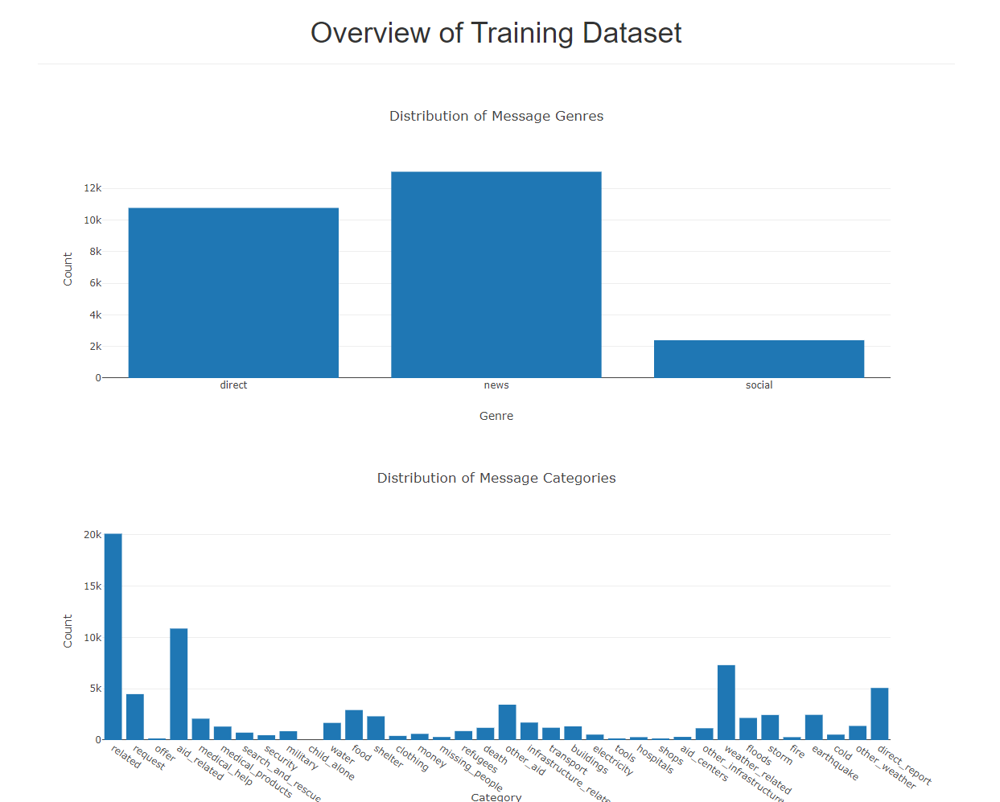
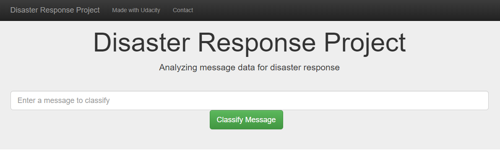
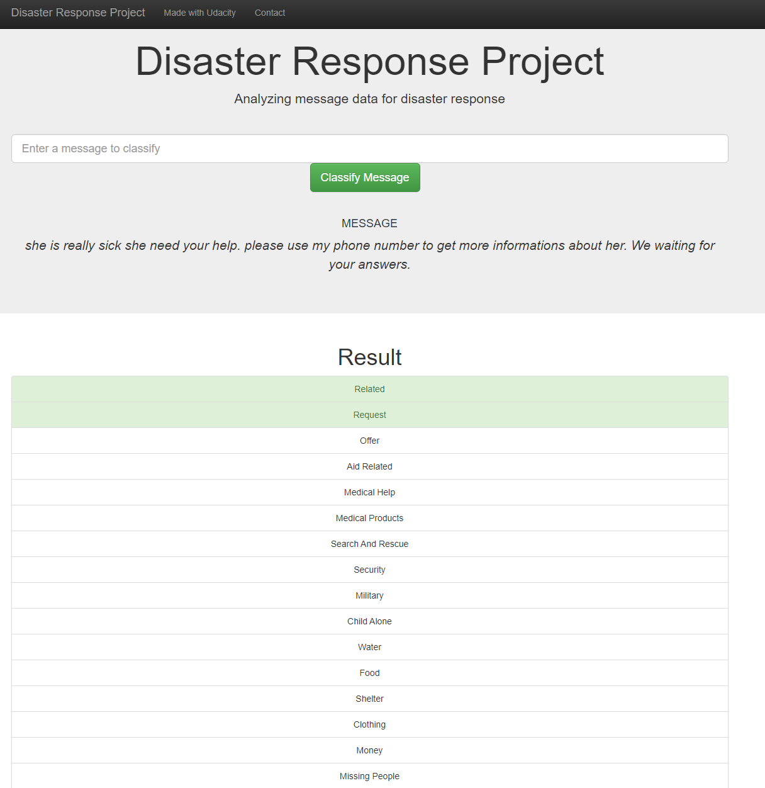

# Disaster Response Pipeline Project

## Project Overview
This project analyzes disaster data from [Figure Eight](https://appen.com/) to build a machine learning model for an API that classifies disaster messages. The goal of the project is to practice building ETL and machine learning pipelines and data visualizations on using web app (Flask and Ginga).

An emergency worker can input a message and get classification results in 36 response categories from the web app. The web app also displays visualizations of the data.

The web app will display the message genre and category counts as below:



It also contains a message bar where an emergency worker can input a message
for classification result.



Below is an example classification result for the message: she is really sick she need your help. please use my phone number to get more informations about her. We waiting for your answers.  



## Files
```bash
.
├── app
│   ├── run.py
│   └── templates
│       ├── go.html
│       └── master.html
├── data
│   ├── disaster_categories.csv
│   ├── disaster_messages.csv
│   ├── DisasterResponse.db
│   ├── process_data.py
│   └── YourDatabaseName.db
├── models
│   ├── classifier.pkl
│   └── train_classifier.py
├── notebooks
│   ├── ETL Pipeline Preparation.ipynb
│   └── ML Pipeline Preparation.ipynb
├── README.md
└── screenshots
    ├── category_count.png
    ├── message_classification_example.png
    └── message_input.png
```

### Instructions:
1. Run the following commands in the project's root directory to set up your database and model.

    - To run ETL pipeline that cleans data and stores in database
        `python data/process_data.py data/disaster_messages.csv data/disaster_categories.csv data/DisasterResponse.db`
    - To run ML pipeline that trains classifier and saves
        `python models/train_classifier.py data/DisasterResponse.db models/classifier.pkl`

2. Run the following command in the app's directory to run your web app.
    `python run.py`

3. Go to http://0.0.0.0:3001/
